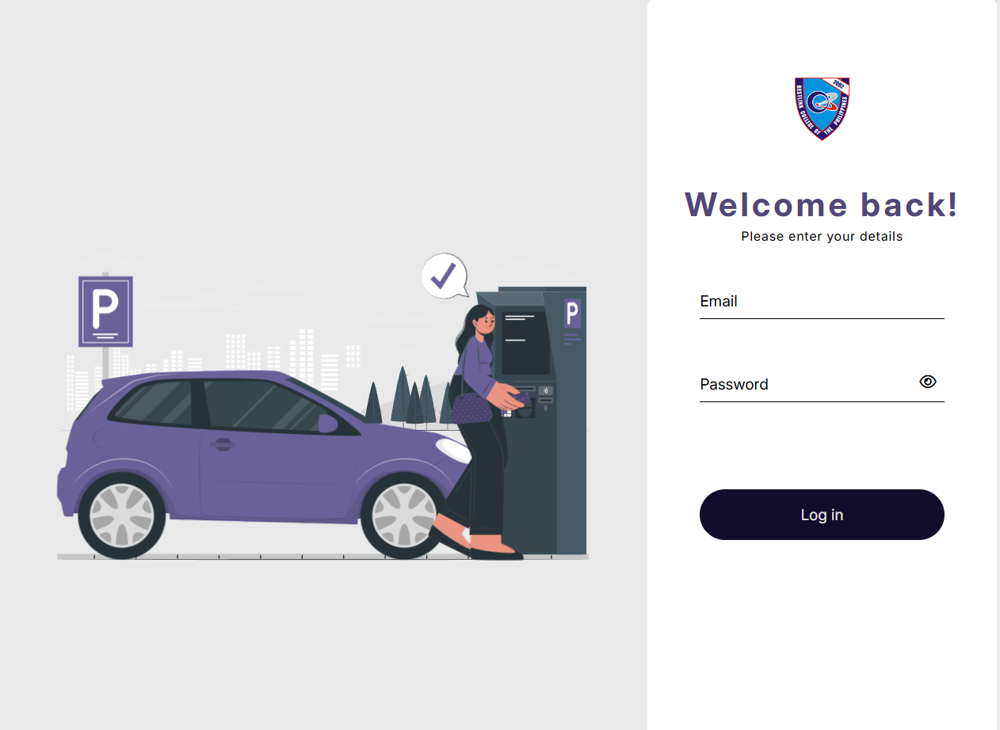

<h1 align="center">🚗 Parking Slot Management System</h1>

A streamlined web-based solution designed to optimize the organization and monitoring of parking spaces across various floors and zones. 
It offers real-time tracking of slot availability, guest details, and vehicle information — ensuring a smooth and efficient parking experience.

  
  
  
  
  

---

<h3 align="center">✨ Key Highlights</h3>

- 🅿️ Real-time slot monitoring and status tracking
- ⏱️ Automatic time tracking and dynamic fee calculation
- 👥 Manage guest and vehicle information efficiently
- 🧾 Editable guest details with immutable slot data for accuracy
- 📶 Multi-floor pagination and modal-based editing
- 📊 Clean, responsive, and user-friendly interface

---

<h3 align="center">🛠️ Tech Stack</h3>

  
  
  
  
  
  

<h3 align="center">🖼️ Screenshots</h3> 
    <em>Dashboard – Overview of slot availability</em>    <em>Guest management and vehicle tracking</em> 

---

<h3 align="center">📈 Future Improvements</h3>

💳 Online payment gateway integration
📱 Fully responsive mobile dashboard
📢 Email/SMS notifications for bookings
📊 Enhanced analytics with charts

---

<h3 align="center">👨‍💻 Author</h3> 
 <b>Section Project</b>  🎓 School Project — Parking Slot Management System  <a href="https://github.com/superrjay" target="_blank">🌐 GitHub Profile</a> 

<h4 align="center">🪪 License</h4> 
 This project is for educational and personal use only.  Feel free to explore, learn, and enhance it. 

